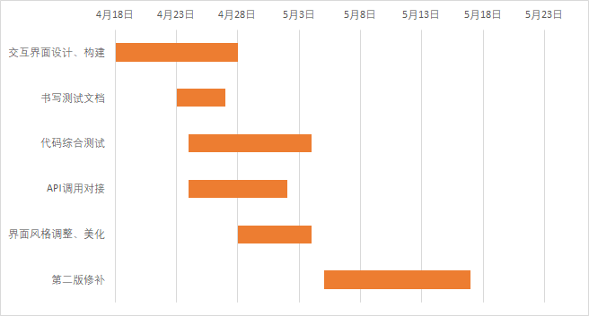
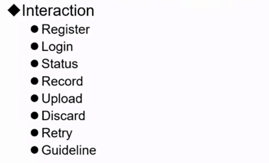

# DSD2022 Interface Spirits

Use interface by URL below

http://tanghaotian.icu

This is the project of Interface group, Spirits. Here some related introduction and information are listed, including the main description of interface, the major functions, the overall design framework as well as the expectation interface.

Software Design Specification (SDS): https://doc.ciel.pro/qYDISClgRgqaTQWMFYi0Vw?both

- Main description

The main task of interface is to provide customers with convenient access to back-end functions. Since we are divided into different groups to realize our respective tasks, the interface group plays a role in dealing with users directly. Users’ requirements usually appear directly on the software interface. They just click the corresponding buttons to meet their requirements and don’t need to know the details of the implementation. Though the coding of interface may be not complicated, the user-oriented service is significant in the whole project.

- Members

| name         | roles                          | email                        |
| ------------ | ------------------------------ | ---------------------------- |
| Jiazheng Pan | Project Manager&liaison        | panjz2119@mails.jlu.edu.cn   |
| Haotian Tang | Programmer&Requirement Analyst | tanght2119@mails.jlu.edu.cn  |
| Weibin Cheng | System Architect&Tester        | chengwb2119@mails.jlu.edu.cn |
| Carlos       | Tester                         | al64388@alunos.utad.pt       |

- Timeline

- Major functions

- Overall design

---------------deploy----------------

docker pull registry.cn-hangzhou.aliyuncs.com/marisadaze/marisadaze:1.0

docker run -it --rm -p 80:5000 registry.cn-hangzhou.aliyuncs.com/marisadaze/marisadaze:1.0

---------------Api----------------

cloud:   https://cloud.tanghaotian.icu:8000

device:   http://119.51.227.115:8081

---------------notes----------------

docker stop $(docker ps -a -q)

docker rm $(docker ps -a -q)

docker container ls -a

docker run -it --rm -p 80:5000 dsd:1.0

docker stop dsd

docker build -f Dockerfile -t dsd:1.0 .

netstat -lnp|grep 80

